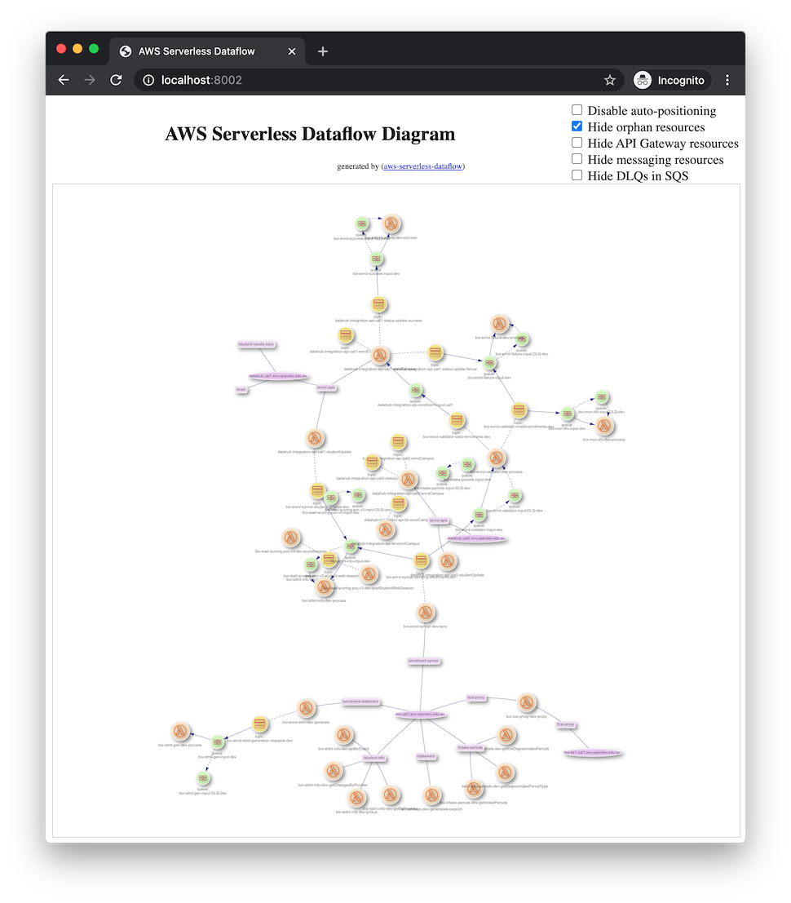

aws-serverless-dataflow
=======================

Visualisation of AWS serverless (Lambda, API Gateway, SNS, SQS, etc.) dataflow

[](https://oclif.io)
[](https://npmjs.org/package/aws-serverless-dataflow)
[](https://npmjs.org/package/aws-serverless-dataflow)
[](https://github.com/james-hu/aws-serverless-dataflow/blob/master/package.json)

This is a command line tool for visualising the connections among AWS serverless (Lambda, API Gateway, SNS, SQS, etc.) components. To run it, you need to log into your AWS account from command line first.

Typical usage:

```sh-session
$ npx aws-serverless-dataflow -r ap-southeast-2 -s
(1/4) Surveying API Gateway and SQS... done
(2/4) Surveying SNS... done
(3/4) Surveying Lambda... done
(4/4) Surveying S3... done
Generating static website content in 'dataflow'... done
Local server started. Ctrl-C to stop. Access URL: http://localhost:8002/
```

The diagram can be viewed from a browser. This is what the diagram looks like:



You can host the generated static files on a website if you like.

Command line option `-r ap-southeast-2` specifies AWS region,
`-s` tells the command line to start up a local http server and then open the browser pointing to that local server for viewing generated content.

If you don't want to include all the resources,
you can use `--include` and `--exclude` options to specify which to include and which to exclude.
Both of them can have multiple appearances.
A resource would be included if any of the `--include` wild card patterns matches and none of the `--include` wild card patterns matches.

`-c` or `--cloud-formation` would enable clustering resouces by CloudFormation stacks.
It is useful when you would like to have a high level view.

## Quick start

You can have it installed globally like this:

```sh-session
$ npm install -g aws-serverless-dataflow
$ aws-serverless-dataflow ...
...
```

Or, you can just invoke the latest version with `npx`:

```sh-session
$ npx aws-serverless-dataflow ...
...
```

By passing `-h` or `--help` to the command line, you can see all supported arguments and options.

## Manual

<!-- help start -->
```
USAGE
  $ aws-serverless-dataflow [PATH]

ARGUMENTS
  PATH  [default: dataflow] path for putting generated website files

OPTIONS
  -c, --cloud-formation  survey CloudFormation stack information (this takes
                         more time)

  -d, --debug            output debug messages

  -h, --help             show CLI help

  -i, --include=include  [default: *] wildcard patterns for domain names and ARN
                         of Lambda functions/SNS topics/SQS queues that should
                         be includeed

  -p, --port=port        [default: 8002] port number of the local http server
                         for preview

  -q, --quiet            no console output

  -r, --region=region    AWS region (required if you don't have AWS_REGION
                         environment variable configured)

  -s, --server           start a local http server and open a browser for
                         pre-viewing generated website

  -v, --version          show CLI version

  -x, --exclude=exclude  wildcard patterns for domain names and ARN of Lambda
                         functions/SNS topics/SQS queues that should be excluded

DESCRIPTION
  This command line tool can visualise AWS serverless (Lambda, API Gateway, SNS, 
  SQS, etc.) dataflow. It generates website files locally and can optionally 
  launch a local server for you to preview.

  Before running this tool, you need to log into your AWS account (through 
  command line like aws, saml2aws, okta-aws, etc.) first. 

  This tool is free and open source: 
  https://github.com/james-hu/aws-serverless-dataflow

EXAMPLES
  aws-serverless-dataflow -r ap-southeast-2 -s
  aws-serverless-dataflow -r ap-southeast-2 -s -i '*boi*' -i '*datahub*' \
         -x '*jameshu*' -c
  aws-serverless-dataflow -r ap-southeast-2 -s -i '*lr-*' \
         -i '*lead*' -x '*slack*' -x '*lead-prioritization*' \
         -x '*lead-scor*' -x '*LeadCapture*' -c
```

<!-- help end -->

## For developers

* Run for test: `./bin/run ...`
* After changing code in `bb-common/`: `npx tsc -b`
* Update README.md: `./bin/run --update-readme.md`
* Release: `npm version patch -m "..."; npm publish`